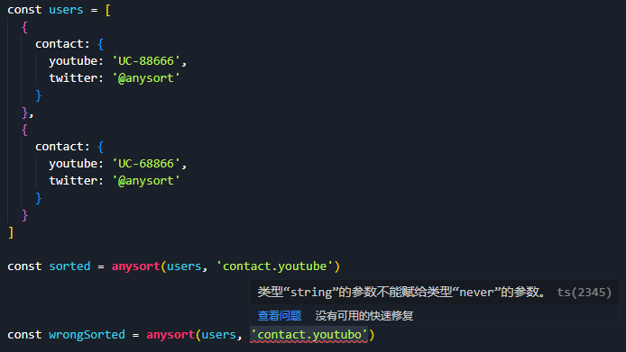

# Anysort

<p align="center">
  
</p>

<p align="center">
  <strong>灵活、类型完备（Full Typed）的多属性排序方法 · Vue/Nuxt 集成</strong>
</p>

Anysort 是一个 pnpm monorepo，提供框架无关的排序核心与 Vue/Nuxt 集成层。

## Why Anysort

A picture is worth a thousand words.

<p align="center">
  
</p>

## Packages

| 包 | 说明 |
| --- | --- |
| [`@anysort/core`](./packages/core) | 框架无关的多属性排序库（Proxy 链式 + call-with-string + Full Typed） |
| [`@anysort/vue`](./packages/vue) | `useAnysort()` composable —— 把排序包装为响应式管道 |
| [`@anysort/nuxt`](./packages/nuxt) | Nuxt module —— auto-import + runtimeConfig 默认排序规则 |

## Playgrounds

| 目录 | 说明 |
| --- | --- |
| [`playground/vue`](./playground/vue) | 纯 Vite + Vue 3 演示（验证 `@anysort/vue` 脱离 Nuxt 可用） |
| [`playground/nuxt`](./playground/nuxt) | Nuxt 4 演示 + module e2e fixture |

## 快速开始

```sh
pnpm install
pnpm build     # 按拓扑序构建所有包（core → vue → nuxt）
pnpm test      # 运行所有包测试
```

开发单个 playground：

```sh
pnpm dev:vue   # playground/vue
pnpm dev:nuxt  # playground/nuxt
```

## 背景

本项目前身为单包 `anysort-typed`，已迁移至 `@anysort` scope 的 monorepo。core 包 API 与 `anysort-typed` 3.x 完全一致。

## License

MIT
